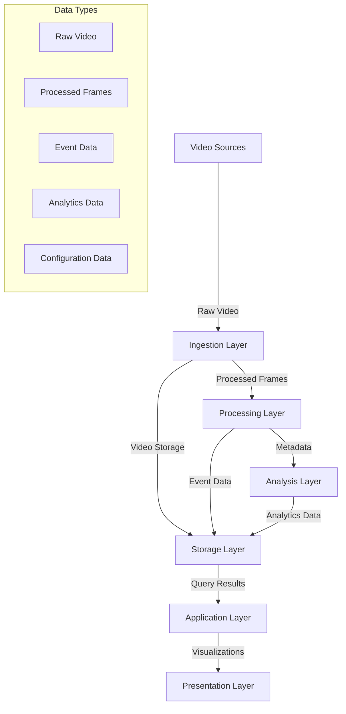

# Data Management Document
## AI Video Surveillance System

## 1. Data Architecture

### 1.1 Data Flow Architecture


### 1.2 Data Classification
```python
class DataClassification:
    DATA_CATEGORIES = {
        "video_data": {
            "type": "binary",
            "retention": "30 days",
            "sensitivity": "high",
            "storage_type": "object_storage"
        },
        "event_data": {
            "type": "structured",
            "retention": "365 days",
            "sensitivity": "high",
            "storage_type": "relational_db"
        },
        "analytics_data": {
            "type": "structured",
            "retention": "730 days",
            "sensitivity": "medium",
            "storage_type": "time_series_db"
        },
        "metadata": {
            "type": "semi-structured",
            "retention": "365 days",
            "sensitivity": "low",
            "storage_type": "document_db"
        }
    }
```

## 2. Data Models

### 2.1 Video Data Model
```python
class VideoDataModel:
    def __init__(self):
        self.schema = {
            "video_id": "UUID",
            "camera_id": "string",
            "timestamp": "datetime",
            "duration": "integer",
            "resolution": "string",
            "format": "string",
            "storage_path": "string",
            "metadata": {
                "fps": "integer",
                "bitrate": "integer",
                "codec": "string",
                "compression": "string"
            }
        }
        
    def create_storage_schema(self):
        return """
        CREATE TABLE video_segments (
            segment_id UUID PRIMARY KEY,
            video_id UUID,
            start_time TIMESTAMP,
            end_time TIMESTAMP,
            file_path TEXT,
            size_bytes BIGINT,
            metadata JSONB,
            FOREIGN KEY (video_id) REFERENCES videos(video_id)
        );
        """
```

### 2.2 Event Data Model
```sql
-- Event Schema
CREATE TABLE events (
    event_id UUID PRIMARY KEY,
    camera_id VARCHAR(50),
    timestamp TIMESTAMP,
    event_type VARCHAR(100),
    confidence FLOAT,
    location_coordinates POINT,
    objects_detected JSONB,
    event_metadata JSONB,
    video_reference UUID,
    created_at TIMESTAMP DEFAULT CURRENT_TIMESTAMP,
    CONSTRAINT fk_video
        FOREIGN KEY(video_reference)
        REFERENCES video_segments(segment_id)
);

-- Event Objects Schema
CREATE TABLE event_objects (
    object_id UUID PRIMARY KEY,
    event_id UUID,
    object_type VARCHAR(50),
    bounding_box BOX,
    confidence FLOAT,
    tracking_id VARCHAR(50),
    attributes JSONB,
    FOREIGN KEY (event_id) REFERENCES events(event_id)
);

-- Event Analytics Schema
CREATE TABLE event_analytics (
    analytics_id UUID PRIMARY KEY,
    event_id UUID,
    analysis_type VARCHAR(50),
    results JSONB,
    confidence_score FLOAT,
    processed_at TIMESTAMP,
    FOREIGN KEY (event_id) REFERENCES events(event_id)
);
```

### 2.3 Analytics Data Model
```python
class AnalyticsDataModel:
    def __init__(self):
        self.time_series_schema = {
            "metrics": {
                "object_counts": {
                    "timestamp": "datetime",
                    "camera_id": "string",
                    "object_type": "string",
                    "count": "integer",
                    "interval": "integer"
                },
                "movement_patterns": {
                    "timestamp": "datetime",
                    "camera_id": "string",
                    "pattern_type": "string",
                    "intensity": "float",
                    "direction": "string"
                }
            },
            "aggregations": {
                "hourly": "1h",
                "daily": "1d",
                "weekly": "1w"
            }
        }
```

## 3. Data Storage Management

### 3.1 Storage Strategy
```python
class StorageManager:
    def __init__(self):
        self.storage_config = {
            "hot_storage": {
                "type": "SSD",
                "retention": "7 days",
                "max_size": "10TB",
                "access_pattern": "random"
            },
            "warm_storage": {
                "type": "HDD",
                "retention": "30 days",
                "max_size": "100TB",
                "access_pattern": "sequential"
            },
            "cold_storage": {
                "type": "Object Storage",
                "retention": "365 days",
                "max_size": "unlimited",
                "access_pattern": "archival"
            }
        }
        
    async def manage_storage_lifecycle(self):
        """
        Manages data lifecycle across storage tiers
        """
        while True:
            await self.move_to_warm_storage()
            await self.archive_to_cold_storage()
            await self.cleanup_expired_data()
```

### 3.2 Backup Strategy
```python
class BackupManager:
    def __init__(self):
        self.backup_config = {
            "full_backup": {
                "frequency": "weekly",
                "retention": "12 weeks",
                "type": "snapshot"
            },
            "incremental_backup": {
                "frequency": "daily",
                "retention": "4 weeks",
                "type": "differential"
            },
            "metadata_backup": {
                "frequency": "hourly",
                "retention": "7 days",
                "type": "full"
            }
        }
```

## 4. Data Access and Security

### 4.1 Access Control
```python
class DataAccessControl:
    def __init__(self):
        self.access_matrix = {
            "admin": {
                "permissions": ["read", "write", "delete", "configure"],
                "scope": "all",
                "restrictions": []
            },
            "operator": {
                "permissions": ["read", "write"],
                "scope": "assigned_cameras",
                "restrictions": ["delete", "configure"]
            },
            "viewer": {
                "permissions": ["read"],
                "scope": "authorized_feeds",
                "restrictions": ["write", "delete", "configure"]
            }
        }
        
    def check_access(self, user, resource, action):
        """
        Validates user access permissions
        """
        role = self.get_user_role(user)
        return action in self.access_matrix[role]["permissions"]
```

### 4.2 Data Encryption
```python
class EncryptionManager:
    def __init__(self):
        self.encryption_config = {
            "at_rest": {
                "algorithm": "AES-256-GCM",
                "key_rotation": "90 days"
            },
            "in_transit": {
                "protocol": "TLS 1.3",
                "cipher_suites": [
                    "TLS_AES_256_GCM_SHA384",
                    "TLS_CHACHA20_POLY1305_SHA256"
                ]
            }
        }
```

## 5. Data Processing Pipeline

### 5.1 Video Processing Pipeline
```python
class VideoProcessor:
    def __init__(self):
        self.pipeline_config = {
            "preprocessing": {
                "resize": (1920, 1080),
                "normalize": True,
                "format": "RGB"
            },
            "processing": {
                "frame_rate": 30,
                "batch_size": 16,
                "gpu_acceleration": True
            }
        }
        
    async def process_video_stream(self, stream):
        """
        Processes video stream and generates data
        """
        frames = await self.preprocess_frames(stream)
        results = await self.analyze_frames(frames)
        await self.store_results(results)
```

### 5.2 Data Aggregation Pipeline
```python
class DataAggregator:
    def __init__(self):
        self.aggregation_rules = {
            "object_counts": {
                "dimensions": ["camera_id", "object_type"],
                "metrics": ["count", "avg_confidence"],
                "intervals": ["5m", "1h", "1d"]
            },
            "events": {
                "dimensions": ["camera_id", "event_type"],
                "metrics": ["count", "severity_distribution"],
                "intervals": ["15m", "1h", "1d"]
            }
        }
```

## 6. Data Retention and Cleanup

### 6.1 Retention Policy
```python
class RetentionManager:
    def __init__(self):
        self.retention_policies = {
            "video_data": {
                "raw_footage": "30 days",
                "event_clips": "90 days",
                "archived_events": "365 days"
            },
            "metadata": {
                "event_data": "180 days",
                "analytics_data": "365 days",
                "system_logs": "90 days"
            }
        }
        
    async def enforce_retention(self):
        """
        Enforces data retention policies
        """
        for data_type, policy in self.retention_policies.items():
            await self.cleanup_expired_data(data_type, policy)
```

### 6.2 Data Cleanup Strategy
```python
class DataCleanupManager:
    def __init__(self):
        self.cleanup_schedule = {
            "daily_cleanup": {
                "time": "02:00 UTC",
                "target": "temporary_files"
            },
            "weekly_cleanup": {
                "time": "Sunday 03:00 UTC",
                "target": "old_video_segments"
            },
            "monthly_cleanup": {
                "time": "1st 04:00 UTC",
                "target": "archived_data"
            }
        }
```

## 7. Data Quality Management

### 7.1 Quality Metrics
```python
class DataQualityManager:
    def __init__(self):
        self.quality_metrics = {
            "video_quality": {
                "resolution": "minimum 720p",
                "frame_rate": "minimum 25fps",
                "bitrate": "minimum 2Mbps"
            },
            "metadata_quality": {
                "completeness": 0.95,
                "accuracy": 0.90,
                "consistency": 0.95
            }
        }
        
    async def monitor_quality(self):
        """
        Monitors data quality metrics
        """
        metrics = await self.collect_quality_metrics()
        if not self.meet_thresholds(metrics):
            await self.generate_quality_alert(metrics)
```

### 7.2 Data Validation
```python
class DataValidator:
    def __init__(self):
        self.validation_rules = {
            "event_data": {
                "required_fields": [
                    "event_id", "camera_id", "timestamp",
                    "event_type"
                ],
                "field_types": {
                    "confidence": "float",
                    "coordinates": "point",
                    "metadata": "json"
                }
            },
            "analytics_data": {
                "required_fields": [
                    "metric_id", "timestamp", "value"
                ],
                "value_ranges": {
                    "confidence": [0.0, 1.0],
                    "count": [0, float('inf')]
                }
            }
        }
```

## 8. Data Recovery and Business Continuity

### 8.1 Recovery Procedures
```python
class RecoveryManager:
    def __init__(self):
        self.recovery_procedures = {
            "video_data": {
                "priority": "high",
                "max_downtime": "1 hour",
                "recovery_point": "15 minutes"
            },
            "metadata": {
                "priority": "medium",
                "max_downtime": "4 hours",
                "recovery_point": "1 hour"
            }
        }
        
    async def initiate_recovery(self, data_type):
        """
        Initiates data recovery procedure
        """
        procedure = self.recovery_procedures[data_type]
        await self.restore_from_backup(data_type, procedure)
```

### 8.2 Business Continuity Plan
```python
class ContinuityManager:
    def __init__(self):
        self.continuity_plan = {
            "failover": {
                "automatic_failover": True,
                "failover_location": "secondary_datacenter",
                "max_failover_time": "5 minutes"
            },
            "redundancy": {
                "data_replication": "synchronous",
                "replication_factor": 3,
                "consistency_level": "strong"
            }
        }
```
