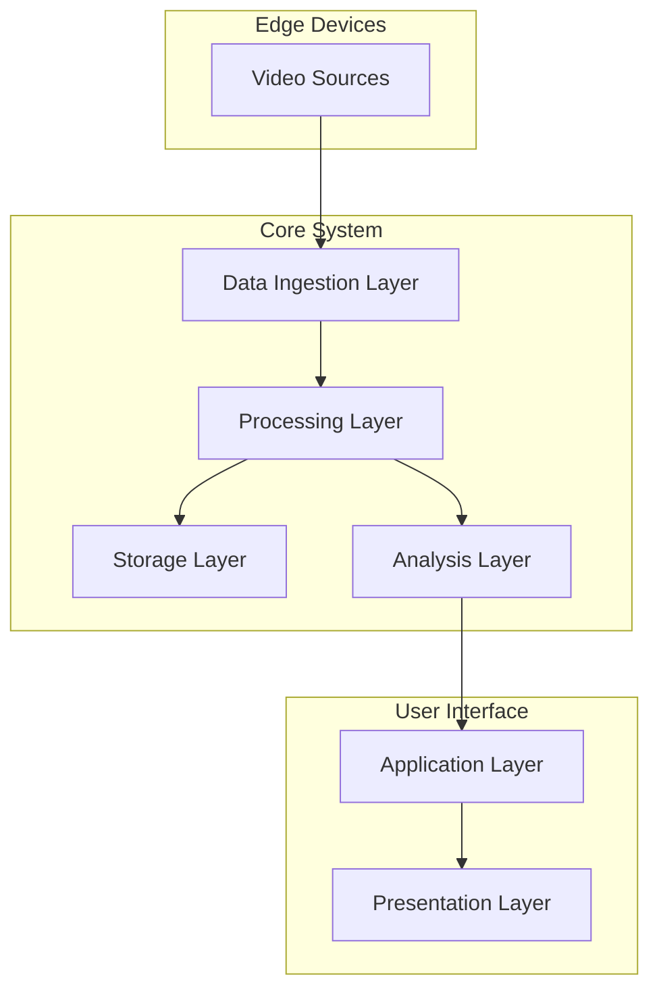
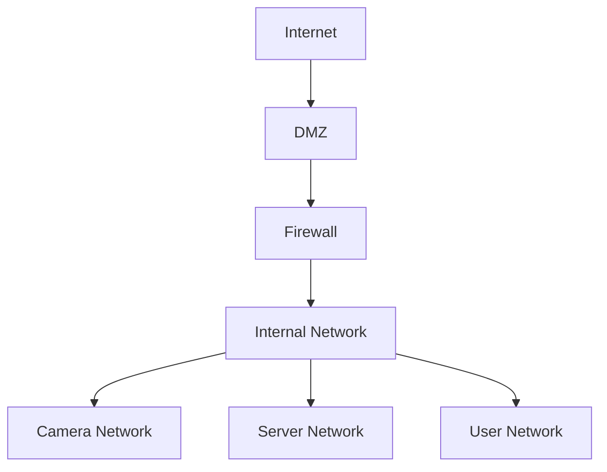
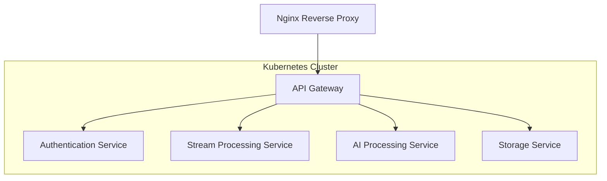

# AI Video Surveillance System Architecture Document

## 1. System Overview

### 1.1 Architecture Goals
- Scalable processing of multiple video streams
- Real-time analysis and alert generation
- Secure data storage and transmission
- High availability and fault tolerance
- Modular design for easy maintenance and upgrades

### 1.2 High-Level Architecture Diagram


## 2. Component Architecture

### 2.1 Data Ingestion Layer
#### Components:
1. **Video Stream Handlers**
   - RTSP Stream Processor
   - HTTP Live Stream (HLS) Handler
   - WebRTC Integration
   ```python
   # Example Video Stream Handler
   class VideoStreamHandler:
       def __init__(self, stream_url, buffer_size=1024):
           self.stream_url = stream_url
           self.buffer_size = buffer_size
           
       def process_stream(self):
           stream = cv2.VideoCapture(self.stream_url)
           while True:
               ret, frame = stream.read()
               if ret:
                   yield self.preprocess_frame(frame)
   ```

2. **Stream Buffer Manager**
   - Frame queuing system
   - Buffer size management
   - Frame rate control

### 2.2 Processing Layer
#### Components:
1. **Frame Preprocessor**
   - Image resizing
   - Color space conversion
   - Noise reduction
   ```python
   # Example Frame Preprocessor
   class FramePreprocessor:
       def __init__(self, target_size=(416, 416)):
           self.target_size = target_size
           
       def preprocess(self, frame):
           resized = cv2.resize(frame, self.target_size)
           normalized = resized / 255.0
           return normalized
   ```

2. **AI Model Pipeline**
   - Object detection model
   - Person recognition model
   - Behavior analysis model
   ```python
   # Example AI Pipeline
   class AIPipeline:
       def __init__(self):
           self.object_detector = YOLODetector()
           self.face_recognizer = FaceNet()
           self.behavior_analyzer = ActionRecognitionModel()
           
       def process_frame(self, frame):
           objects = self.object_detector.detect(frame)
           faces = self.face_recognizer.identify(frame)
           behaviors = self.behavior_analyzer.analyze(frame)
           return self.merge_results(objects, faces, behaviors)
   ```

### 2.3 Storage Layer
#### Components:
1. **Database Systems**
   - Time-series database for metrics
   - Document store for events
   - Object storage for video clips
   
   Example Database Schema:
   ```sql
   CREATE TABLE surveillance_events (
       event_id SERIAL PRIMARY KEY,
       camera_id VARCHAR(50),
       timestamp TIMESTAMP,
       event_type VARCHAR(100),
       confidence FLOAT,
       metadata JSONB,
       video_clip_url VARCHAR(255)
   );
   ```

2. **Video Storage Manager**
   - Video compression
   - Storage rotation
   - Archival management

### 2.4 Analysis Layer
#### Components:
1. **Event Processor**
   ```python
   class EventProcessor:
       def __init__(self):
           self.event_queue = Queue()
           self.rules_engine = RulesEngine()
           
       def process_event(self, event):
           if self.rules_engine.evaluate(event):
               self.generate_alert(event)
   ```

2. **Analytics Engine**
   - Real-time metrics calculation
   - Historical analysis
   - Trend detection

### 2.5 Application Layer
#### Components:
1. **API Gateway**
   ```python
   from fastapi import FastAPI
   
   app = FastAPI()
   
   @app.get("/api/v1/cameras")
   async def get_cameras():
       return {"cameras": camera_manager.get_all_cameras()}
   
   @app.get("/api/v1/events")
   async def get_events(
       camera_id: str, 
       start_time: datetime, 
       end_time: datetime
   ):
       return event_manager.query_events(
           camera_id, 
           start_time, 
           end_time
       )
   ```

2. **Authentication Service**
   - JWT token management
   - Role-based access control
   - Session management

### 2.6 Presentation Layer
#### Components:
1. **Web Interface**
   ```javascript
   // Example React Component
   const LiveView = () => {
     const [streams, setStreams] = useState([]);
     const [alerts, setAlerts] = useState([]);
     
     useEffect(() => {
       // Connect to WebSocket for real-time updates
       const ws = new WebSocket('ws://api/streams');
       ws.onmessage = (event) => {
         updateStreams(JSON.parse(event.data));
       };
     }, []);
     
     return (
       <div className="live-view">
         <StreamGrid streams={streams} />
         <AlertPanel alerts={alerts} />
       </div>
     );
   };
   ```

2. **Mobile Application**
   - Real-time notifications
   - Mobile-optimized views
   - Offline capabilities

## 3. System Requirements

### 3.1 Hardware Requirements
- **Edge Devices (Per Camera)**
  - Processor: Intel Core i5 or equivalent
  - RAM: 8GB minimum
  - Storage: 256GB SSD
  - Network: 1Gbps Ethernet

- **Central Server**
  - Processor: Dual Intel Xeon or equivalent
  - RAM: 64GB minimum
  - Storage: 4TB NVMe SSD + 20TB HDD Storage
  - GPU: NVIDIA RTX 3080 or better

### 3.2 Software Requirements
- **Operating System**
  - Ubuntu 20.04 LTS or later
- **Databases**
  - PostgreSQL 13+
  - Redis 6+
- **AI Frameworks**
  - TensorFlow 2.x
  - PyTorch 1.x
- **Development Tools**
  - Docker
  - Kubernetes
  - Git

## 4. Security Architecture

### 4.1 Network Security


### 4.2 Data Security
- End-to-end encryption for video streams
- At-rest encryption for stored data
- Regular security audits
- Access logging and monitoring

## 5. Deployment Architecture

### 5.1 Container Architecture


### 5.2 Scaling Strategy
- Horizontal scaling for stream processors
- Vertical scaling for AI processing
- Load balancing across processing nodes
- Auto-scaling based on demand

## 6. Monitoring and Maintenance

### 6.1 System Monitoring
- Real-time performance metrics
- Resource utilization tracking
- Error logging and alerting
- System health dashboard

### 6.2 Maintenance Procedures
- Regular backup schedule
- System update protocol
- Performance optimization
- Incident response plan
