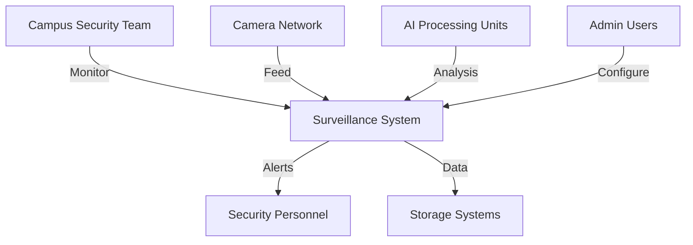
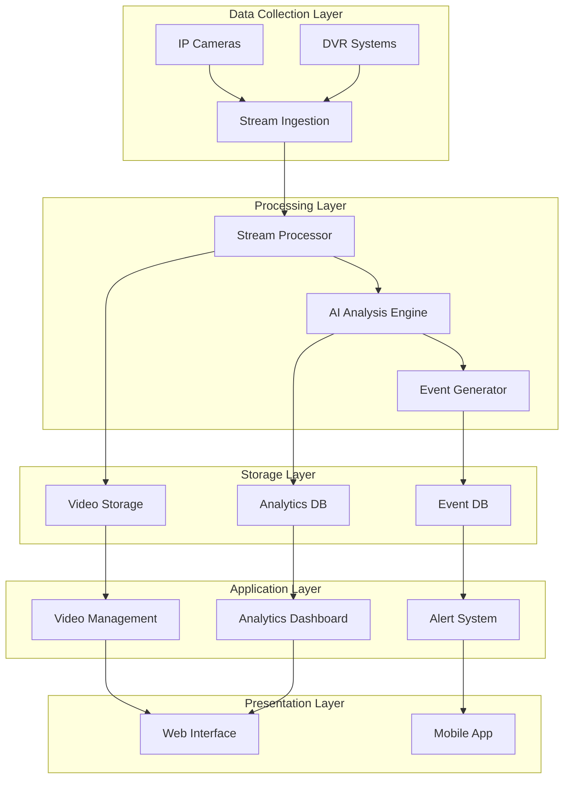
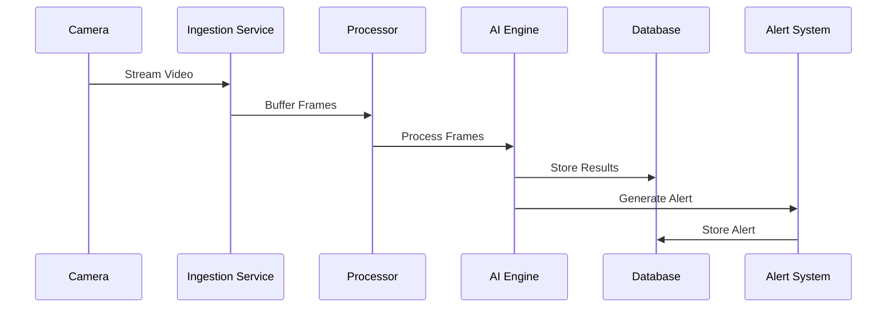

# System Design Document (SDD)
## AI-Based Video Surveillance System

## 1. Introduction

### 1.1 Purpose
This document provides detailed design specifications for an AI-based video surveillance system intended for university campus security and monitoring.

### 1.2 Scope
The system encompasses real-time video monitoring, AI-based analysis, alert generation, and data management capabilities.

### 1.3 System Context


## 2. System Architecture

### 2.1 High-Level Design


### 2.2 Component Design

#### 2.2.1 Video Ingestion Component
```python
class VideoIngestionService:
    def __init__(self):
        self.stream_manager = StreamManager()
        self.buffer_size = 30  # frames
        
    async def ingest_stream(self, camera_id: str, stream_url: str):
        """
        Handles video stream ingestion from cameras
        """
        stream = await self.stream_manager.connect(stream_url)
        frame_buffer = collections.deque(maxlen=self.buffer_size)
        
        while True:
            frame = await stream.get_frame()
            frame_buffer.append(frame)
            await self.process_buffer(camera_id, frame_buffer)
```

#### 2.2.2 AI Analysis Engine
```python
class AIAnalysisEngine:
    def __init__(self):
        self.object_detector = ObjectDetectionModel()
        self.face_recognizer = FaceRecognitionModel()
        self.behavior_analyzer = BehaviorAnalysisModel()
        
    async def analyze_frame(self, frame: np.ndarray):
        """
        Performs AI analysis on a single frame
        """
        results = {
            'objects': await self.object_detector.detect(frame),
            'faces': await self.face_recognizer.identify(frame),
            'behaviors': await self.behavior_analyzer.analyze(frame)
        }
        return await self.merge_results(results)
```

#### 2.2.3 Event Processing System
```python
class EventProcessor:
    def __init__(self):
        self.rule_engine = RuleEngine()
        self.alert_manager = AlertManager()
        
    async def process_event(self, event_data: dict):
        """
        Processes detected events and generates alerts
        """
        if await self.rule_engine.evaluate(event_data):
            alert = await self.create_alert(event_data)
            await self.alert_manager.send_alert(alert)
```

### 2.3 Database Design

#### 2.3.1 Event Database Schema
```sql
-- Events Table
CREATE TABLE events (
    event_id SERIAL PRIMARY KEY,
    camera_id VARCHAR(50),
    timestamp TIMESTAMP,
    event_type VARCHAR(100),
    severity INTEGER,
    location_id VARCHAR(50),
    metadata JSONB,
    video_clip_url VARCHAR(255)
);

-- Alerts Table
CREATE TABLE alerts (
    alert_id SERIAL PRIMARY KEY,
    event_id INTEGER REFERENCES events(event_id),
    alert_type VARCHAR(100),
    status VARCHAR(50),
    created_at TIMESTAMP,
    updated_at TIMESTAMP,
    assigned_to VARCHAR(100)
);

-- Camera Metadata Table
CREATE TABLE cameras (
    camera_id VARCHAR(50) PRIMARY KEY,
    location VARCHAR(100),
    status VARCHAR(50),
    capabilities JSONB,
    last_maintained TIMESTAMP
);
```

#### 2.3.2 Analytics Database Schema
```sql
-- Analytics Events
CREATE TABLE analytics_events (
    id SERIAL PRIMARY KEY,
    timestamp TIMESTAMP,
    camera_id VARCHAR(50),
    event_type VARCHAR(100),
    object_count INTEGER,
    confidence FLOAT,
    metadata JSONB
);

-- Time Series Metrics
CREATE TABLE metrics_timeseries (
    metric_id SERIAL PRIMARY KEY,
    timestamp TIMESTAMP,
    metric_name VARCHAR(100),
    value FLOAT,
    camera_id VARCHAR(50)
);
```

## 3. Interface Design

### 3.1 API Endpoints
```python
from fastapi import FastAPI, HTTPException
from pydantic import BaseModel

app = FastAPI()

class AlertRequest(BaseModel):
    camera_id: str
    event_type: str
    severity: int
    metadata: dict

@app.post("/api/v1/alerts")
async def create_alert(alert: AlertRequest):
    try:
        alert_id = await alert_service.create_alert(alert)
        return {"alert_id": alert_id}
    except Exception as e:
        raise HTTPException(status_code=500, detail=str(e))

@app.get("/api/v1/cameras/{camera_id}/status")
async def get_camera_status(camera_id: str):
    status = await camera_service.get_status(camera_id)
    return status
```

### 3.2 Web Interface Design
```typescript
// React Component for Live View
interface LiveViewProps {
    cameraId: string;
    options: ViewOptions;
}

const LiveView: React.FC<LiveViewProps> = ({ cameraId, options }) => {
    const [stream, setStream] = useState<MediaStream | null>(null);
    const [analytics, setAnalytics] = useState<Analytics>({});

    useEffect(() => {
        // Initialize video stream
        initializeStream(cameraId);
        // Set up analytics websocket
        setupAnalyticsSocket(cameraId);
    }, [cameraId]);

    return (
        <div className="live-view-container">
            <VideoPlayer stream={stream} />
            <AnalyticsOverlay data={analytics} />
            <AlertPanel cameraId={cameraId} />
        </div>
    );
};
```

## 4. Data Flow Design

### 4.1 Video Processing Pipeline


### 4.2 Event Processing Flow
```python
class EventProcessingPipeline:
    def __init__(self):
        self.preprocessor = EventPreprocessor()
        self.analyzer = EventAnalyzer()
        self.validator = EventValidator()
        
    async def process_event(self, event: Event):
        # Preprocess event data
        processed_data = await self.preprocessor.process(event)
        
        # Analyze event
        analysis_result = await self.analyzer.analyze(processed_data)
        
        # Validate results
        if await self.validator.validate(analysis_result):
            return await self.save_results(analysis_result)
```

## 5. Security Design

### 5.1 Authentication System
```python
class SecuritySystem:
    def __init__(self):
        self.auth_provider = AuthenticationProvider()
        self.jwt_service = JWTService()
        
    async def authenticate_user(self, credentials: dict):
        """
        Handles user authentication
        """
        user = await self.auth_provider.validate_credentials(credentials)
        if user:
            token = await self.jwt_service.generate_token(user)
            return {'token': token, 'user': user}
        raise AuthenticationError()
```

### 5.2 Authorization Matrix
```python
AUTHORIZATION_MATRIX = {
    'admin': {
        'cameras': ['view', 'configure', 'add', 'remove'],
        'alerts': ['view', 'modify', 'delete'],
        'analytics': ['view', 'export'],
        'users': ['view', 'add', 'modify', 'remove']
    },
    'operator': {
        'cameras': ['view', 'configure'],
        'alerts': ['view', 'modify'],
        'analytics': ['view'],
        'users': ['view']
    },
    'viewer': {
        'cameras': ['view'],
        'alerts': ['view'],
        'analytics': ['view'],
        'users': []
    }
}
```

## 6. Performance Design

### 6.1 Scaling Strategy
```python
class ScalingManager:
    def __init__(self):
        self.resource_monitor = ResourceMonitor()
        self.load_balancer = LoadBalancer()
        
    async def scale_processing(self, metrics: dict):
        """
        Manages system scaling based on load
        """
        if await self.resource_monitor.check_threshold(metrics):
            new_instance = await self.load_balancer.add_instance()
            await self.redistribute_load(new_instance)
```

### 6.2 Caching Strategy
```python
class CacheManager:
    def __init__(self):
        self.frame_cache = LRUCache(maxsize=1000)
        self.result_cache = TTLCache(maxsize=5000, ttl=3600)
        
    async def cache_frame(self, frame_id: str, frame_data: bytes):
        """
        Manages frame caching
        """
        await self.frame_cache.set(frame_id, frame_data)
        
    async def cache_result(self, result_id: str, result: dict):
        """
        Manages analysis results caching
        """
        await self.result_cache.set(result_id, result)
```

## 7. Deployment Design

### 7.1 Container Configuration
```yaml
# Docker Compose Configuration
version: '3.8'
services:
  video-processor:
    image: surveillance-video-processor
    deploy:
      replicas: 3
      resources:
        limits:
          cpus: '2'
          memory: 4G
    environment:
      - CUDA_VISIBLE_DEVICES=0
      
  ai-engine:
    image: surveillance-ai-engine
    deploy:
      replicas: 2
      resources:
        limits:
          cpus: '4'
          memory: 8G
    environment:
      - MODEL_PATH=/models
      
  api-server:
    image: surveillance-api
    deploy:
      replicas: 2
      resources:
        limits:
          cpus: '1'
          memory: 2G
```

### 7.2 Monitoring Configuration
```python
class MonitoringSystem:
    def __init__(self):
        self.metrics_collector = MetricsCollector()
        self.alert_generator = AlertGenerator()
        
    async def monitor_system(self):
        """
        Monitors system health and performance
        """
        metrics = await self.metrics_collector.collect()
        if await self.check_thresholds(metrics):
            await self.alert_generator.generate_alert(metrics)
```

## 8. Testing Strategy

### 8.1 Test Cases
```python
class TestSuite:
    def __init__(self):
        self.test_data = TestDataGenerator()
        self.validator = ResultValidator()
        
    async def test_detection(self):
        """
        Tests object detection capabilities
        """
        test_frames = await self.test_data.generate_frames()
        results = await self.run_detection(test_frames)
        return await self.validator.validate_results(results)
```

### 8.2 Performance Testing
```python
class PerformanceTester:
    def __init__(self):
        self.load_generator = LoadGenerator()
        self.metrics_collector = MetricsCollector()
        
    async def run_load_test(self, config: dict):
        """
        Executes system load testing
        """
        await self.load_generator.generate_load(config)
        metrics = await self.metrics_collector.collect_metrics()
        return await self.analyze_results(metrics)
```
